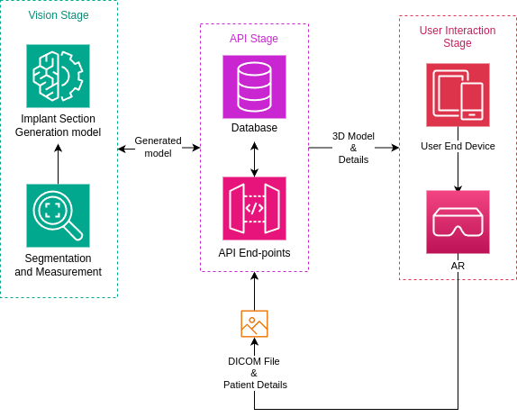
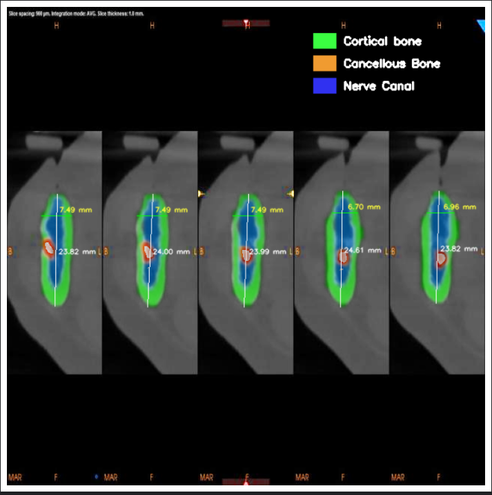

# GIST-3DR

The GIST-3DR project aims to revolutionize dental implant procedures by integrating cutting-edge technologies such as 3D Augmented Reality (AR) and advanced segmentation models. The primary objective is to automate and personalize implant generation, addressing critical issues like improper dimensions, nerve canal damage, and lack of regional visualization. By utilizing CT scan data, GIST-3DR generates detailed 3D models of oral anatomy, enabling clinicians to visualize, plan, and execute implant surgeries with precision.

## Features
- 3D AR visualization of dental implants
- Advanced segmentation models for accurate implant generation
- Personalized implant generation based on CT scan data
- Improvement in implant planning and execution
- Reduction in errors and time spent on manual implant placement

## Model results
The below results are generated by the MaskRCNN model
